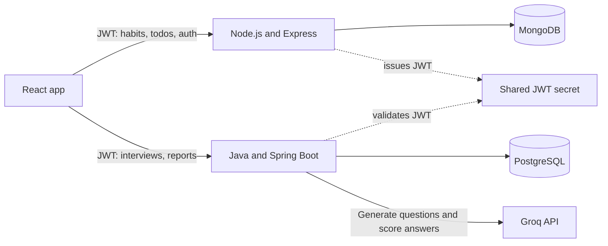

# TuDummmm

### Build a consistent study habit. Prepare for your next interview.

TuDummmm combines a study consistency tracker with AI-powered mock interviews in one full-stack application. Track habits, focus time, and todos, then practice against questions tailored to a job description and review scored feedback.

<p align="center">
  <a href="https://tudummmm.vercel.app/">Live app</a> ·
  <a href="https://github.com/Muditgolaa/TuDummmm">Source code</a> ·
  <a href="https://github.com/Muditgolaa/TuDummmm/issues">Report an issue</a>
</p>


---

## What you can do

- **Track study habits:** create habits, record daily completion, focus minutes, and notes, and review activity in a 26-week heatmap with streaks.
- **Manage todos:** add, edit, complete, and remove tasks.
- **Practice interviews:** enter a role, company, and job description; generate tailored questions; submit answers; and receive AI-generated scores and feedback.
- **Review progress:** view interview reports and aggregate analytics. Completing an interview can also contribute focus time to the study tracker.
- **Sign in securely:** register with email and password or use Google sign-in. Protected data is scoped to the authenticated user.

## Product flow



The application is split into two backend services by domain. The Node service owns accounts and study tracking in MongoDB. The Spring Boot service owns interview sessions and results in PostgreSQL. The Node service issues JWTs, and both services validate them using the same secret. Each service owns its data store.

## Built with

| Area | Technologies |
| --- | --- |
| Frontend | React 19, Vite, Tailwind CSS 4, React Router |
| Core API | Node.js, Express 5, MongoDB, Mongoose |
| Interview API | Java 21, Spring Boot 4, Spring Data JPA, Spring Security |
| AI | Groq API for question generation and answer feedback |
| Quality and delivery | Vitest, Supertest, Testcontainers, GitHub Actions, Docker Compose, Jenkins |

## Run locally

### Requirements

- Git
- Docker Desktop (for the databases and/or full backend stack)
- Node.js 22 and npm
- Java 21 (only when running the interview service outside Docker)
- A Groq API key
- A Google OAuth client ID if you want Google sign-in

### 1. Get the code and configure secrets

```bash
git clone https://github.com/Muditgolaa/TuDummmm.git
cd TuDummmm
cp .env.example .env
```

Edit `.env`. Set `JWT_SECRET` to a long random value (at least 32 characters) and `GROQ_API_KEY` to your key. `GOOGLE_CLIENT_ID` is needed for Google sign-in. The same JWT secret is passed to both backend services.

### 2. Start the backend services and databases

```bash
docker compose up --build
```

This starts MongoDB, PostgreSQL, the Node API at `http://localhost:5001`, and the interview API at `http://localhost:8080`. PostgreSQL data is stored in a Docker volume. Keep this terminal open while using the app.

### 3. Start the frontend

In a second terminal:

```bash
cd frontend
npm install
```

Create `frontend/.env.local` with the backend addresses:

```dotenv
VITE_API_URL=http://localhost:5001
VITE_INTERVIEW_API_URL=http://localhost:8080
VITE_GOOGLE_CLIENT_ID=your-google-client-id
```

Then run:

```bash
npm run dev
```

Open the local URL printed by Vite (normally `http://localhost:5173`). The backend CORS setting defaults to that address; set `CLIENT_URL` in the root `.env` if you use a different frontend origin, then restart Compose.

Stop the services with `Ctrl+C`, then `docker compose down`. To also delete the persisted database data, run `docker compose down -v`.

### Run the frontend and Node API without Compose

The Node service requires MongoDB and these environment variables: `MONGODB_URI`, `JWT_SECRET`, `GROQ_API_KEY`, and `CLIENT_URL`. The root `.env` is read automatically by Docker Compose, but is not loaded when you start the backend directly. Start MongoDB separately, then from the repository root run:

```bash
set -a
source .env
set +a
export MONGODB_URI=mongodb://localhost:27017/tudummmm
cd backend
npm install
npm run dev
```

To run the interview service directly, start PostgreSQL with database `interview`, user `tudummmm`, and password `tudummmm` (or provide `DB_URL`, `DB_USER`, and `DB_PASSWORD`). Then, from the repository root:

```bash
cd interview-service
JWT_SECRET='your-shared-secret-at-least-32-characters' GROQ_API_KEY='your-groq-key' ./mvnw spring-boot:run
```

Use the same `JWT_SECRET` for both backend services. Never commit `.env`, API keys, OAuth secrets, or production credentials.

## API at a glance

All protected endpoints expect `Authorization: Bearer <token>`. The Node API issues the token at registration or login; the frontend sends it to both APIs.

| Service | Endpoint | Purpose |
| --- | --- | --- |
| Node | `POST /api/auth/register`, `POST /api/auth/login` | Create an account or sign in |
| Node | `POST /api/auth/google` | Sign in with a Google credential |
| Node | `/api/habits` | Create, list, update, and delete habits |
| Node | `/api/logs`, `/api/logs/:date` | Read and update daily study logs |
| Node | `/api/todos` | Create, list, update, and delete todos |
| Interview | `POST /api/sessions` | Create an interview session |
| Interview | `POST /api/sessions/:id/generate` | Generate questions for a session |
| Interview | `GET /api/sessions/:id/questions` | List generated questions |
| Interview | `POST /api/questions/:id/answers` | Submit an answer for scoring |
| Interview | `GET /api/sessions/:id/report` | Read a session report |
| Interview | `GET /api/analytics` | Read interview analytics |

Example: create an interview session (replace the token and values):

```bash
curl -X POST http://localhost:8080/api/sessions \
  -H 'Authorization: Bearer <token>' \
  -H 'Content-Type: application/json' \
  -d '{"jobTitle":"Software Engineer","company":"Example Co","jobDescription":"Build reliable APIs and distributed services."}'
```

## Checks and CI

Run checks from the relevant project directory:

```bash
# Frontend: lint, unit tests, and production build
cd frontend && npm install && npm run lint && npm test && npm run build

# Node API tests
cd ../backend && npm install && npm test

# Interview service tests
cd ../interview-service && ./mvnw test
```

GitHub Actions runs frontend lint/tests/build, backend tests, and the Java service verification on pushes to `main` and on pull requests. The Jenkins pipeline builds and verifies the interview service, then builds its Docker image.

## Repository layout

```text
.
├── backend/             # Express API: auth, habits, logs, todos
├── frontend/            # React application
├── interview-service/   # Spring Boot API: interviews and analytics
├── docker-compose.yml   # MongoDB, PostgreSQL, and backend services
└── .github/workflows/   # Continuous integration
```

## Security notes

- Keep secrets in local environment files or a secrets manager; do not commit them.
- Use a unique, random JWT secret with at least 32 bytes, shared by both backend services.
- Configure the Google OAuth client ID and allowed frontend origin for your deployment.
- Review CORS origins, rate limits, database credentials, and API-key handling before deploying publicly.

## Author

**Mudit Gola** · [GitHub](https://github.com/Muditgolaa)

Feedback and issues are welcome through [GitHub Issues](https://github.com/Muditgolaa/TuDummmm/issues).
